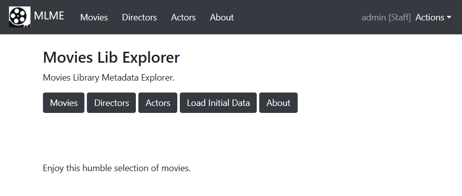

## Movies Library Metadata Explorer - MLME

    Movies Library Metadata Explorer using Django.
    It includes a REST API for the catalog models using Django REST framework.

   * The program 

	program: Movies Library Metadata Explorer using Django.
    name as a package: movies_lib_explorer 
	version: 0.0.2
	author: Joan A. Pinol
	author_nickname: japinol
	author_gitHub: japinol7
	author_twitter: @japinol
	requirements: Django 4.1
	Python requires: 3.10 or greater.
	Python versions tested: 
        > 3.10.10 64bits under Windows 11

## Screenshots

    
    
    
    
  

## Catalog Directors REST API

http://127.0.0.1:8000/catalog/api/v1/directors   
http://127.0.0.1:8000/catalog/api/v1/directors/1

* Get all directors  
curl -i http://127.0.0.1:8000/catalog/api/v1/directors

* Get all directors as an authenticated user  
curl -i http://127.0.0.1:8000/catalog/api/v1/directors \\  
-H 'Authorization: Token '$MLME_REST_API_TOKEN

* Get director with id 1  
curl -i http://127.0.0.1:8000/catalog/api/v1/directors/1 -w '\n'

* Get all directors which last name is Coppola 
curl -i http://127.0.0.1:8000/catalog/api/v1/directors?last_name=Coppola

* Get all directors which last name is Coppola and first name is Sofia 
curl -i "http://127.0.0.1:8000//catalog/api/v1/directors?last_name=Coppola&first_name=Sofia"

* Get all directors searching for john in their last name or first name and ordering them by: last_name, first_name  
curl -i "http://127.0.0.1:8000/catalog/api/v1/directors?search=john&ordering=last_name,first_name"

* Create new director  
curl -i http://127.0.0.1:8000/catalog/api/v1/directors \\  
-X POST \\  
-H 'Content-Type: application/json' \\  
-H 'Authorization: Token '$MLME_REST_API_TOKEN \\  
-d '{"last_name": "Test-Director-Last_Name", "first_name": "Test-Director-First_Name"}'
 

* Change name of director with id 626  
curl -i http://127.0.0.1:8000/catalog/api/v1/directors/626 \\  
-X PUT \\  
-H 'Content-Type: application/json' \\  
-H 'Authorization: Token '$MLME_REST_API_TOKEN \\  
-d '{"last_name": "Test-Director-Last_Name Updated", "first_name": "Test-Director-First_Name Updated"}'

* Delete director with id 626  
curl -i http://127.0.0.1:8000/catalog/api/v1/directors/626 \\  
-X DELETE \\  
-H 'Authorization: Token '$MLME_REST_API_TOKEN
   

## Catalog Actors REST API

http://127.0.0.1:8000/catalog/api/v1/actors   
http://127.0.0.1:8000/catalog/api/v1/actors/27

### Similar to directors REST API. For example:

* Get all actors which last name is "Toshiro Mifune"  
curl -i "http://127.0.0.1:8000/catalog/api/v1/actors?last_name=Toshiro%20Mifune"
   

* Get all actors which last name is "Toshiro Mifune" as an authenticated user  
curl -i "http://127.0.0.1:8000/catalog/api/v1/actors?last_name=Toshiro%20Mifune" \\  
-H 'Authorization: Token '$MLME_REST_API_TOKEN
   

## Catalog Movies REST API

http://127.0.0.1:8000/catalog/api/v1/movies   
http://127.0.0.1:8000/catalog/api/v1/movies/1

* Get all movies  
curl -i http://127.0.0.1:8000/catalog/api/v1/movies

* Get all movies as an authenticated user  
curl -i http://127.0.0.1:8000/catalog/api/v1/movies \\  
-H 'Authorization: Token '$MLME_REST_API_TOKEN

* Get movie with id 1  
curl -i http://127.0.0.1:8000/catalog/api/v1/movies/1 -w '\n'

* Get all movies of year 1935  
curl -i http://127.0.0.1:8000/catalog/api/v1/movies?year=1935

* Get movies of year 1935 ordered by director's last name and director's first name  
curl -i "http://127.0.0.1:8000/catalog/api/v1/movies?year=1935&ordering=director__last_name,director__first_name"

* Get all movies for director's last name equal to Coppola  
curl -i http://127.0.0.1:8000/catalog/api/v1/movies?director__last_name=Coppola

* Get all movies for director's last name equal to Coppola and director's first name equal to Sofia  
curl -i "http://127.0.0.1:8000//catalog/api/v1/movies?director__last_name=Coppola&director__first_name=Sofia"

* Get all movies for director's id equal to 222  
curl -i "http://127.0.0.1:8000/catalog/api/v1/movies?director__id=222"

* Get movies from year greater than 1922 to year lower than 1924  
curl -i "http://127.0.0.1:8000/catalog/api/v1/movies?year__gt=1921&year__lt=1924"

* Get movies created on the database on a given date  
curl -i "http://127.0.0.1:8000/catalog/api/v1/movies?created__date=2023-05-23"

* Get movies created on the database exactly on a given date  
curl -i "http://127.0.0.1:8000/catalog/api/v1/movies?created=2023-05-23T20:53:28.449880Z"

* Get movies created on the database between these date times (not inclusive): from 2023-05-23 20:53:00 to 2023-05-23 20:53:26   
curl -i "http://127.0.0.1:8000/catalog/api/v1/movies?created__date__gt=2023-05-22&created__date__lt=2023-05-24&created__time__gt=20:53:00&created__time__lt=20:53:26"
 

* Get all movies searching for "thin man" in the search fields and ordering them by year  
curl -i "http://127.0.0.1:8000/catalog/api/v1/movies?search=thin%20man&ordering=year"

* Get all movies searching for "Cary Grant" in the search fields and ordering them by year  
curl -i "http://127.0.0.1:8000/catalog/api/v1/movies?search=Cary%20Grant&ordering=year"

* Get all movies searching for "thin man" in the search fields and ordering them by year in descending order  
curl -i "http://127.0.0.1:8000/catalog/api/v1/movies?search=thin%20man&ordering=-year"

* Create new movie  
curl -i http://127.0.0.1:8000/catalog/api/v1/movies \\  
-X POST \\  
-H 'Content-Type: application/json' \\  
-H 'Authorization: Token '$MLME_REST_API_TOKEN \\  
-d '{"title": "Test: A Story of Floating Weeds", "title_original": "Test: Ukikusa monogatari", "director": "4", "year": "1934", "runtime": "86", "country": "JP", "language": "Japanese", "cast": "Takeshi Sakamoto, Chōko Iida, Kōji Mitsui, Rieko Yagumo, Yoshiko Tsubouchi"}'

* Change name of movie with id 1371  
curl -i http://127.0.0.1:8000/catalog/api/v1/movies/1371 \\  
-X PUT \\  
-H 'Content-Type: application/json' \\  
-H 'Authorization: Token '$MLME_REST_API_TOKEN \\  
-d '{"title": "Test 2: A Story of Floating Weeds", "title_original": "Test 2: Ukikusa monogatari", "year": "1934"}'

* Delete movie with id 1371  
curl -i http://127.0.0.1:8000/catalog/api/v1/movies/1371 \\  
-X DELETE \\  
-H 'Authorization: Token '$MLME_REST_API_TOKEN
   

## Catalog Movies REST API - Format as XML instead of JSON

### Similar to previous examples but adding format=xml. For example:

* Get all movies of year 1935 formatted as XML 
curl -i http://127.0.0.1:8000/catalog/api/v1/movies?year=1935&format=xml
   

## How to create a token to authenticate on the REST API

### How to create a token for a  given user; for example, the admin user  

./manage.py drf_create_token admin
* Then set an env variable MLME_REST_API_TOKEN to the generated token
 

### How to ask a token to the API for a given user  

* First, set env variables for the username and their password: MLME_USERNAME, MLME_PASSWORD .
* Then:  
curl -i http://127.0.0.1:8000/catalog/api/v1/token-auth \\  
-X POST \\  
-d 'username='$MLME_USERNAME \\  
-d 'password='$MLME_PASSWORD
* Then set an env variable MLME_REST_API_TOKEN to the generated token
   

## Default API settings
 
* Pagination  
  API_PAGE_SIZE = 300    

* Throttling for anonymous and authorized users  
  API_DEFAULT_THROTTLE_RATES_ANON = '300/day'  
  API_DEFAULT_THROTTLE_RATES_USER = '30/minute'  
   

## Default local url

http://127.0.0.1:8000/
   

## User Guide

* Only staff users have permission to edit catalog data. This includes uploading photos.  
  So, the following buttons are hidden from no-staff users: \[Edit] &nbsp;&nbsp;\[Upload ... Photo]
* Any user can add a movie review and edit the reviews they wrote.
   

## To run the tests for this project

* You need to run the tests using the test settings file this way:  
python manage.py test --settings=movies_lib_explorer.test_settings
   

## To make this app server work

	Do this:
	    1. Clone this repository in your local system.
	    2. Go to its folder in your system.
	    3. $ pip install -r requirements.txt
	    4. The first time you must create a new database with the right tables this way:
	       $ python manage.py migrate
	       4.1 You can also create an admin user this way, so you can log in, create other users, etc:
	          $ python manage.py createsuperuser
	    5. $ python manage.py runserver
	    6. Open the website indicated in the console in your browser.
	       Example: http://127.0.0.1:8000/
	    7. The first time, press the button [Load Initial Data] on the main web page.
	       This imports sample data with several movies, directors and actors.
	       This also creates links between actors and movies.
