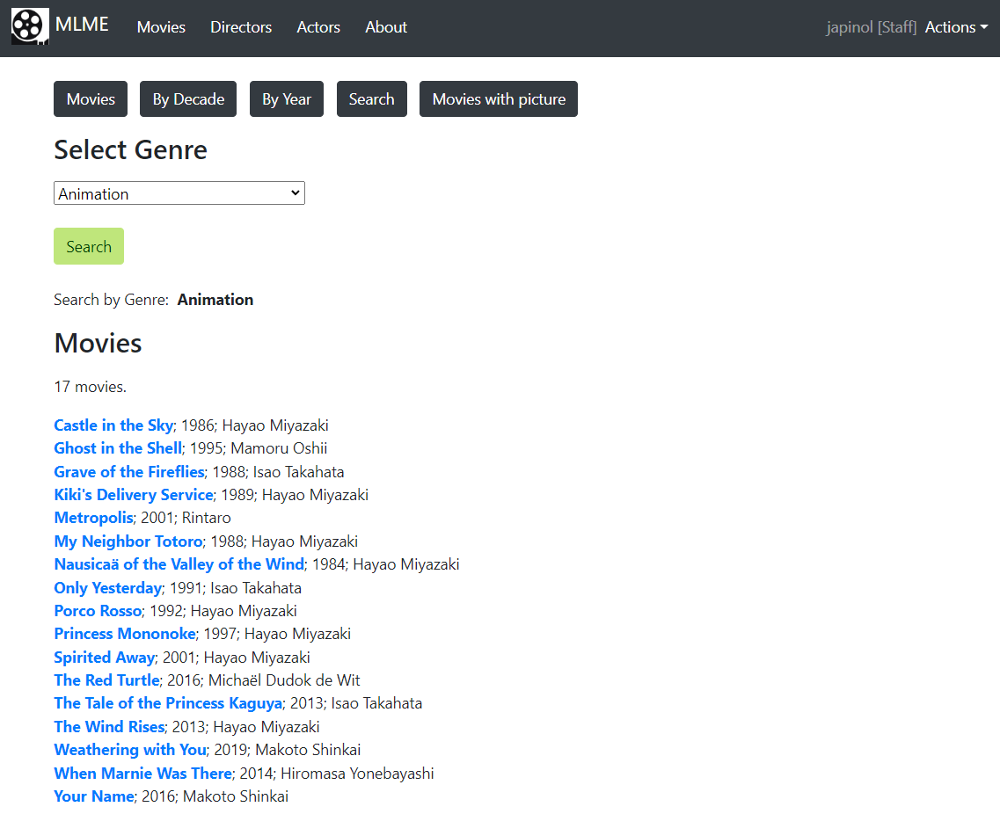
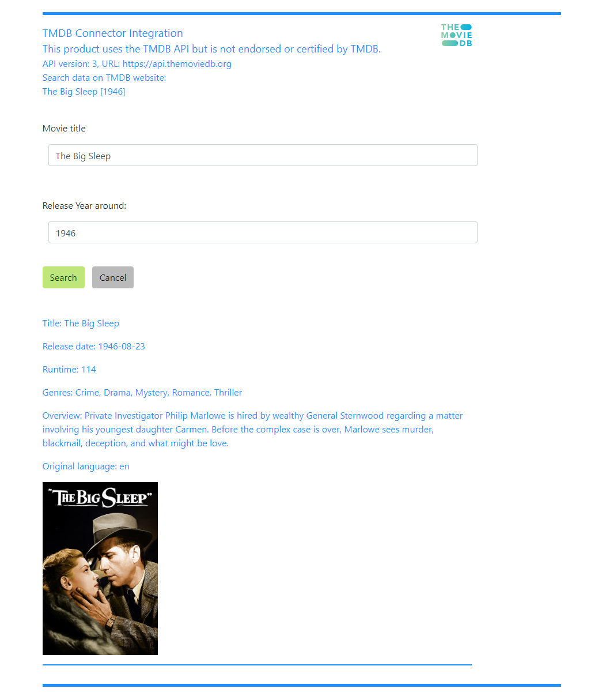

## Movies Library Metadata Explorer

    Movies Library Metadata Explorer using Django.

   * The program 

	program: Movies Library Metadata Explorer using Django.
    name as a package: movies_lib_explorer 
	version: 0.0.1
	author: Joan A. Pinol
	author_nickname: japinol
	author_gitHub: japinol7
	author_twitter: @japinol
	requirements: Django 4.1
	Python requires: 3.10 or greater.
	Python versions tested: 
        > 3.10.10 64bits under Windows 11

## Screenshots

    
    
    
    
  

## Catalog Directors REST API

http://127.0.0.1:8000/   
http://127.0.0.1:8000/catalog/api/v1/directors/   
http://127.0.0.1:8000/catalog/api/v1/directors/1/

* Get all directors  
curl -i http://127.0.0.1:8000/catalog/api/v1/directors/

* Get director with id 1  
curl -i http://127.0.0.1:8000/catalog/api/v1/directors/1/ -w '\n'

* Create new director  
curl -i http://127.0.0.1:8000/catalog/api/v1/directors/ \
-X POST \
-H 'Content-Type: application/json' \
-H 'Authorization: Token '$MLE_REST_API_TOKEN \
-d '{"last_name": "Test-Director-Last_Name", "first_name": "Test-Director-First_Name"}' \
-w '\n'

* Change name of director with id 314  
curl -i http://127.0.0.1:8000/catalog/api/v1/directors/314/ \
-X PUT \
-H 'Content-Type: application/json' \
-H 'Authorization: Token '$MLE_REST_API_TOKEN \
-d '{"last_name": "Test-Director-Last_Name Updated", "first_name": "Test-Director-First_Name Updated"}' \
-w '\n'

* Delete director with id 3  
curl -i http://127.0.0.1:8000/catalog/api/v1/directors/317/ \
-X DELETE \
-H 'Authorization: Token '$MLE_REST_API_TOKEN

* How to create a token for the admin user to authenticate on the REST API  
./manage.py drf_create_token admin
* Then set an env variable MLE_REST_API_TOKEN to the generated token
   

## To make this app server work

	Do this:
	    1. Clone this repository in your local system.
	    2. Go to its folder in your system.
	    3. $ pip install -r requirements.txt
	    4. The first time you must create a new database with the right tables this way:
	       $ python manage.py migrate
	       4.1 You can also create an admin user this way, so you can log in, create other users, etc:
	          $ python manage.py createsuperuser
	    5. $ python manage.py runserver
	    6. Open the website indicated in the console in your browser.
	       Example: http://127.0.0.1:8000/
