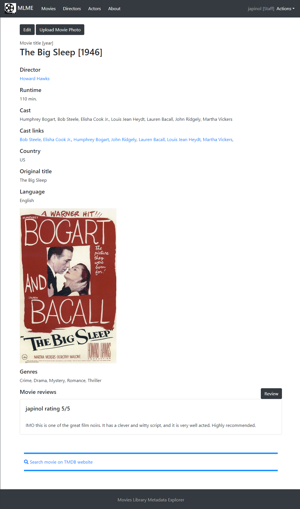

## Movies Library Metadata Explorer

    Movies Library Metadata Explorer using Django.

   * The program 

	program: Movies Library Metadata Explorer using Django.
    name as a package: movies_lib_explorer 
	version: 0.0.1
	author: Joan A. Pinol
	author_nickname: japinol
	author_gitHub: japinol7
	author_twitter: @japinol
	requirements: Django 4.1
	Python requires: 3.9 or greater.
	Python versions tested: 
        > 3.9.12 64bits under Windows 11

## Screenshots

    
    
    
  

**To make this app server work**

	Do this:
	    1. Clone this repository in your local system.
	    2. Go to its folder in your system.
	    3. $ pip install -r requirements.txt
	    4. $ python manage.py runserver
	    5. Open the website indicated in the console in your browser.
	       Example: http://127.0.0.1:8000/
